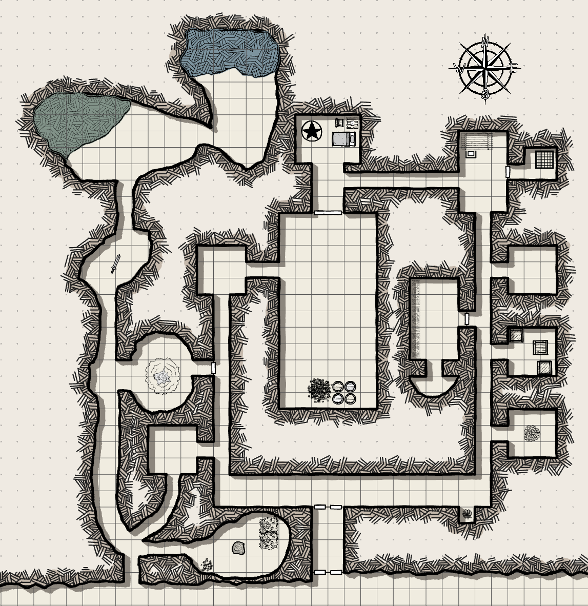

## Overview

The Barrow is an ancient burial mound near [[locations/world/agria/southlands/barrowshire/barrow-spa|Barrow Spa]]. It was once infested with undead until the Bonebreakers purged its necromantic corruption. Later, Barny and other spellcasters claimed it as a place of study.

## Geography and layout

- The site is a tunnelled burial mound with hidden passages, collapsed areas, and deeper chambers.
- Known chambers include Quintius's quarters, Alfwine's former chambers, and a healing pool discovered on a later return.

## Notable sublocations

- Natural escape tunnel
- Caved-in corridor
- Tapestry room
- Quintius's room
- Healing pool

## Associated people and groups

- Quintius was tied to the undead activity in the Barrow.
- Alfwine, a trapped fairy, aided the party before later dying in their defence.
- Barny later uses the cleansed Barrow for research.
- In Session 62, Barny secretly orders the zombified [[npcs/westmarsh/kargaz-the-disciplined|Kargaz the Disciplined]] to travel here after the battle at Westfort. Whether Kargaz arrives remains unknown.

## Campaign events

- The first three sessions centre on clearing the Barrow and uncovering its necromantic trouble.
- In [[sessions/session-023|Session 23]], the party revisits the site and confirms its later use as a safer research space.
- In [[sessions/session-062|Session 62]], Barny sends the invisible, reanimated Kargaz toward the Barrow without telling the rest of the party.

## Related sessions

- [[sessions/session-001|Session 1]]
- [[sessions/session-002|Session 2]]
- [[sessions/session-003|Session 3]]
- [[sessions/session-023|Session 23]]
- [[sessions/session-062|Session 62]]

## Unresolved threads or mysteries

- The Barrow is largely resolved as an adventuring site, though some of its older history remains unclear.
- Whether Kargaz reached the Barrow, and what Barny intends for him there, remain unknown.
