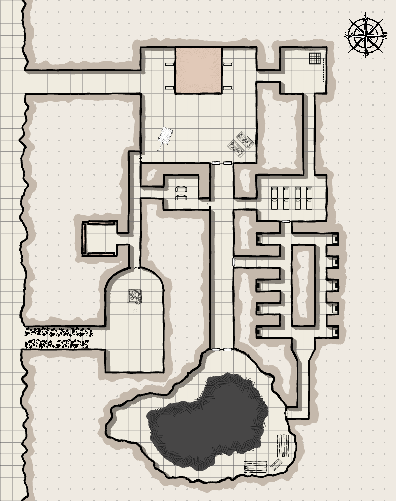

## Overview

The Shrine of the Oozing Serpent is a semi-ruined gnome-built complex in the sandstone cliffs at the edge of [[locations/world/agria/southlands/barrowshire/kelfrek-marsh|Kelfrek Marsh]]. Part temple and part foundry, it preserves evidence of an older struggle against the demon Mulvis. The party later identifies the same site as Gruumsh's old shrine base.

## Geography and layout

- The complex includes shrine chambers, foundry space, catacombs, automaton rooms, and deeper lairs.
- Its structure mixes religious architecture with industrial machinery.

## Notable sublocations

- Statue chamber
- Foundry
- Automaton room
- Embalming room
- Catacombs
- Sootmurk's cavern

## Associated people and groups

- Sootmurk, the Grease Dragon, laired here.
- Gruumsh One-tusk later used the shrine as a fortified base.
- Orcs, Gloops, and trapped priests all become part of the shrine's campaign history.

## Campaign events

- In [[sessions/session-004|Session 4]] through [[sessions/session-006|Session 6]], the Bonebreakers explore the complex and kill Sootmurk.
- In [[sessions/session-024|Session 24]] and [[sessions/session-025|Session 25]], they return to rescue priests from Gruumsh's force and break the warband.

## Related sessions

- [[sessions/session-004|Session 4]]
- [[sessions/session-005|Session 5]]
- [[sessions/session-006|Session 6]]
- [[sessions/session-007|Session 7]]
- [[sessions/session-024|Session 24]]
- [[sessions/session-025|Session 25]]

## Unresolved threads or mysteries

- The shrine's oldest history and its connection to Mulvis are still only partly known.
