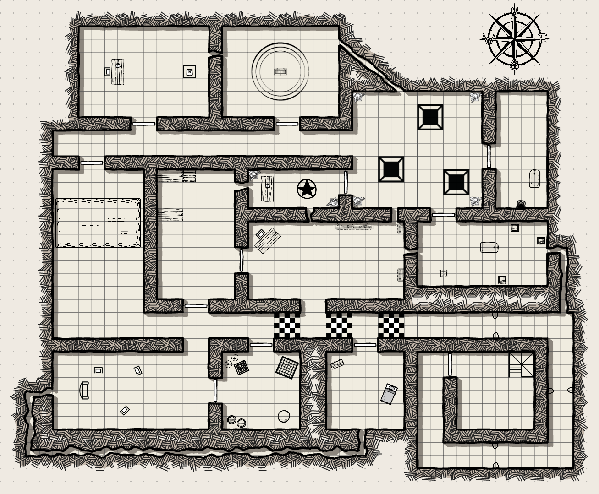

## Overview

The Jeweller's Sanctum is the trap-filled dungeon beneath [[locations/world/agria/southlands/barrowshire/tarantella-manor|Tarantella Manor]]. It contains mechanical puzzles, illusions, dangerous magical constructs, and the remains of Draxas Tarantella's private experimentation.

## Geography and layout

- The Sanctum is a sprawling under-manor complex with false floors, trapped chambers, hidden routes, and flooded sections.
- Repeated delves reveal a deeper workshop culture rather than a single treasure vault.

## Notable sublocations

- Checkered-floor trap rooms
- Ruined library
- Pentagram chamber
- Mirror room
- Flooded trap chamber
- Study
- Ruined laboratory
- Rat Queen's parlor

## Associated people and groups

- Draxas Tarantella built the complex.
- Morlan and the Rat Queen appear in the later stages of the delve.

## Campaign events

- The Bonebreakers begin exploring the Sanctum in [[sessions/session-008|Session 8]].
- The dungeon continues as a major multi-session arc through [[sessions/session-012|Session 12]].
- Published lore says the site was eventually cleared and made safe by the party.

## Related sessions

- [[sessions/session-008|Session 8]]
- [[sessions/session-009|Session 9]]
- [[sessions/session-010|Session 10]]
- [[sessions/session-011|Session 11]]
- [[sessions/session-012|Session 12]]

## Unresolved threads or mysteries

- The site is treated as cleared, but some of Draxas's broader magical aims remain unclear.
