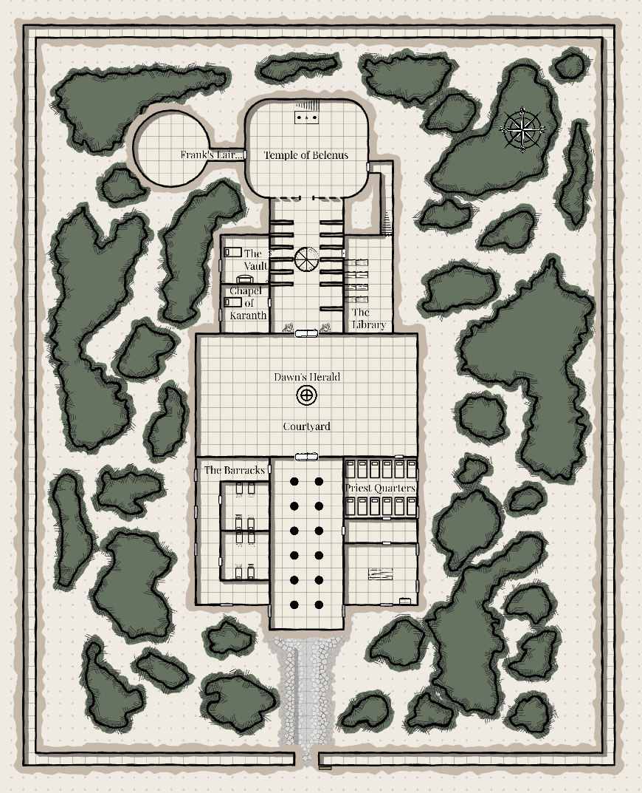

## Overview

The Mercy was once the Church of the Crimson Flame, a sanctuary of Bahal that fell into corruption and became the centre of the deathless plague. After the fall of the Crimson Bishop and his followers, the Bonebreakers claimed the site and Princess Agatha formally granted it to them, making it the main stronghold of the [[factions/religions-and-cults/belenites|Belenites]].

## Geography and layout

- The cathedral lies north-west of [[locations/world/agria/southlands/ikiria|Ikiria]] behind outer walls and overgrown gardens.
- The site is split between a southern hall and a northern domed section.
- Later exploration reveals a poisoned well, hidden lower stairs, and a route into [[locations/world/westmarsh/necropolis|the Necropolis]].

## Notable sublocations

- Bell plaza
- Southern cathedral hall
- Library
- Bishop's quarters and sanctum
- Hidden lower chamber
- Poisoned well
- Cathedral vault

## Associated people and groups

- The Crimson Bishop, the Sons of Bahal, and the Crimson Knights once held the site.
- Sir Cedric and surviving priests help reclaim it.
- Bishop Arden later leads it under the new name The Mercy.
- Athlestan also helps reshape it around both [[factions/religions-and-cults/belenites|Belenite]] and [[factions/religions-and-cults/karanth|Karanth]] worship.

## Campaign events

- The party receives the mission to end the plague in [[sessions/session-018|Session 18]].
- [[sessions/session-019|Session 19]] through [[sessions/session-022|Session 22]] cover the assault and liberation of the cathedral.
- [[sessions/session-024|Session 24]] and [[sessions/session-025|Session 25]] deal with the site's first major counterattack.
- In [[sessions/session-040|Session 40]] and later, the Mercy becomes the staging ground for the Necropolis arc and for worsening plague rumours.

## Related sessions

- [[sessions/session-018|Session 18]]
- [[sessions/session-019|Session 19]]
- [[sessions/session-020|Session 20]]
- [[sessions/session-021|Session 21]]
- [[sessions/session-022|Session 22]]
- [[sessions/session-041|Session 41]]
- [[sessions/session-045|Session 45]]

## Unresolved threads or mysteries

- The exact relationship between the Mercy and [[locations/world/westmarsh/necropolis|the Necropolis]] remains only partly understood.
- Plague, unrest, and questions around Arden's leadership remain unresolved.
